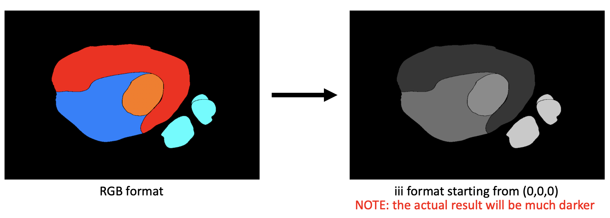

# black_mask_to_coloured
convert coloured (RGB) mask (.png) into one channel black mask for machine learning segmentation.



## USAGE
Configure [Line15~17](maskcvt_git.py#L15-L17)
```python
path = '/Users/bogus/Downloads/SegmentationClass/' # Source Folder
dstpath = '/Users/bogus/Downloads/SegmentationClass2/' # Destination Folder

#color mapping
VOC_COLORMAP = [[176, 112, 32], [48, 240, 32], [48, 112, 32], [176, 240, 160],
                [176, 240, 32], [48, 240, 160], [176, 112, 160]]
```
- configure path
- need to specify VOC_COLORMAP with corresponding class name
- VOC_CLASSES is not used in code but just for guide of colormap
## run
```bash
python maskcvt_git.py
```
